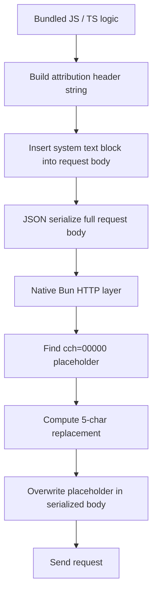
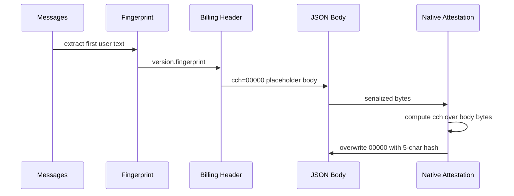
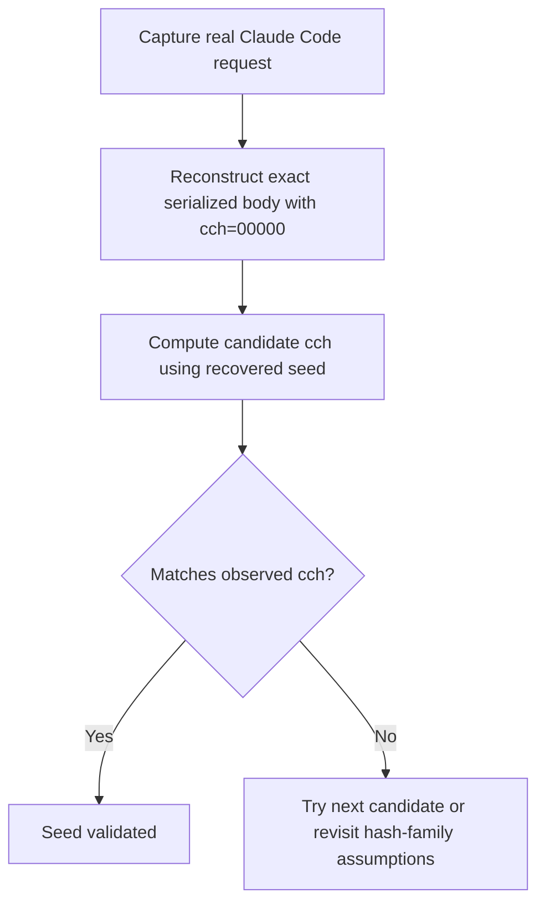

# Claude Code Attestation Extraction Playbook

This document is a practical playbook for recovering the **Claude Code
attribution fingerprint salt** and **`cch` attestation seed** from a future
Claude Code binary, even if the values change and are not known in advance.

It is grounded in what was directly verified from the current installed Claude
Code binary on this machine:

- Binary path: `/Users/rmk/.local/share/claude/versions/2.1.90`
- Binary type: Mach-O 64-bit executable arm64
- Verified current values:
  - `MACRO.VERSION = 2.1.90`
  - fingerprint salt = `59cf53e54c78`
  - `cch` seed = `0x6E52736AC806831E`
- Verified current layout:
  - JS-side attribution logic is visible via `strings`
  - the seed is embedded as an 8-byte constant in `__TEXT,__const`

This playbook assumes **you start with no seed or salt** in a future release.

---

## Scope

This playbook is for extracting or validating:

1. **Version** used in attribution (`MACRO.VERSION`)
2. **Fingerprint salt** used in `cc_version={version}.{fingerprint}`
3. **Attribution header format**
4. **`cch` placeholder behavior**
5. **`cch` seed** used by the native attestation implementation

This playbook does **not** attempt to prove the exact native hashing algorithm
instruction-by-instruction. It is focused on practical recovery and validation.

---

## Tools Required

Verified available on this machine:

- `/usr/bin/strings`
- `/usr/bin/otool`
- `/usr/bin/lldb`
- `/opt/homebrew/bin/python3`

Optional but helpful:

- Ghidra / Hopper / IDA / Binary Ninja
- `xxhash-wasm` for replay validation
- a request proxy capture from a real Claude Code request

---

## Mental Model

Claude Code currently has two layers involved in attribution:



The extraction work therefore splits naturally into:

1. **JS-side extraction**
   - version
   - salt
   - billing header format
   - placeholder/gating rules

2. **Native-side extraction**
   - attestation seed
   - possibly enough evidence to identify the hash family

---

## End Goal

For any future Claude Code release, you want to answer these questions:

| Question                                                       | Desired Output      |
| -------------------------------------------------------------- | ------------------- |
| What version does attribution use?                             | `2.x.y`             |
| What salt is used for the `cc_version` fingerprint?            | hex/string constant |
| Is attribution still inserted as `x-anthropic-billing-header`? | yes/no              |
| Is `cch` still placeholder-based?                              | e.g. `cch=00000`    |
| Is `cch` gated by provider/build flags?                        | yes/no + conditions |
| What seed does native attestation use?                         | 64-bit constant     |
| Can I validate a candidate seed?                               | yes/no              |

---

## Phase 1: Locate the Active Claude Code Binary

### 1.1 Resolve the `claude` symlink

```bash
which claude
file "$(which claude)"
ls -lh "$(which claude)"
```

On this machine:

```text
/Users/rmk/.local/bin/claude -> /Users/rmk/.local/share/claude/versions/2.1.90
```

### 1.2 Confirm the real binary path

```bash
file /Users/rmk/.local/share/claude/versions/2.1.90
```

Expected output shape:

```text
Mach-O 64-bit executable arm64
```

If the binary format changes in the future, the later steps may need adapting.

---

## Phase 2: Extract JS-Side Attribution Facts from the Binary

This is the fastest and most reliable part. The bundled JS is rich in literal
strings and often contains the attribution logic nearly intact.

### 2.1 Search the binary strings

```bash
strings -a "/path/to/claude-binary" | rg \
  'x-anthropic-billing-header|cch=00000|59cf53e54c78|VERSION:"|CLAUDE_CODE_ENTRYPOINT|cc_workload|bedrock|anthropicAws'
```

### 2.2 What to look for

You want to find a compiled string fragment that reveals something like:

```js
VERSION: "2.1.90";
ZY5 = "59cf53e54c78";
let O = !(K === "bedrock" || K === "anthropicAws") ? " cch=00000;" : "";
let z = T ? ` cc_workload=${T};` : "";
let A = `x-anthropic-billing-header: cc_version=${_}; cc_entrypoint=${q};${O}${z}`;
```

From this, you can directly recover:

- version
- fingerprint salt
- whether `cch` is still placeholder-based
- whether `cch` is gated by provider
- whether `cc_workload` still exists and where it appears

### 2.3 Extraction checklist

| Value                 | Recovery Method                                                    |
| --------------------- | ------------------------------------------------------------------ |
| Version               | Search for `VERSION:"` or nearby attribution string assembly       |
| Salt                  | Search for `59cf53e54c78`-like hex string near fingerprint helpers |
| Placeholder           | Search for `cch=00000`                                             |
| Billing header format | Search for `x-anthropic-billing-header:`                           |
| Gating                | Search nearby for provider names or feature flag logic             |

### 2.4 If strings become sparse or minified further

Even if symbol names disappear, the literal strings usually still survive:

- `x-anthropic-billing-header:`
- `cch=00000;`
- `cc_workload=`
- version literals
- salt string

If all of those disappear, the build model likely changed significantly.

---

## Phase 3: Confirm Fingerprint Algorithm Inputs

The JS bundle often also contains enough to recover the `cc_version`
fingerprint behavior.

### 3.1 Search for the salt and nearby logic

```bash
strings -a "/path/to/claude-binary" | rg '59cf53e54c78|\[4,7,20\]|sha256|slice\(0,3\)'
```

### 3.2 What you want to confirm

Current known fingerprint semantics:

```text
chars = [4, 7, 20].map(i => messageText[i] || '0').join('')
fingerprint = SHA256(salt + chars + version).hex().slice(0, 3)
```

### 3.3 Why this matters for `cch`

The fingerprint is part of `cc_version`, and `cc_version` is embedded into the
serialized body before native replacement. Therefore, any change to the
fingerprint algorithm changes the bytes that the native `cch` hashing step sees.



---

## Phase 4: Recover the Native `cch` Seed via Static Binary Analysis

This is the key reusable technique.

### 4.1 Search raw bytes for a known seed candidate

When you have a candidate seed from a third party or prior version, search for
it directly in the binary.

Example with the currently known seed:

```bash
python3 - <<'PY'
from pathlib import Path
p = Path('/path/to/claude-binary')
data = p.read_bytes()
needle = (0x6E52736AC806831E).to_bytes(8, 'little')
idx = data.find(needle)
print(idx)
if idx != -1:
    print(data[idx:idx+16].hex())
PY
```

Current verified result on this machine:

```text
offset = 56994384
bytes  = 1e8306c86a73526e...
```

### 4.2 Map that offset to a Mach-O section

```bash
python3 - <<'PY'
from pathlib import Path
import subprocess

text = subprocess.check_output([
    'otool', '-l', '/path/to/claude-binary'
], text=True)

lines = text.splitlines()
sections = []
cur = {}
for line in lines:
    s = line.strip()
    if s.startswith('sectname '):
        cur['sectname'] = s.split()[1]
    elif s.startswith('segname '):
        cur['segname'] = s.split()[1]
    elif s.startswith('offset '):
        cur['offset'] = int(s.split()[1])
    elif s.startswith('size '):
        cur['size'] = int(s.split()[1], 16)
        if {'sectname','segname','offset','size'} <= cur.keys():
            sections.append(cur)
            cur = {}

needle = 56994384
for sec in sections:
    if sec['offset'] <= needle < sec['offset'] + sec['size']:
        print(sec)
PY
```

Current verified result:

```text
{'offset': 54140672, 'sectname': '__const', 'segname': '__TEXT', 'size': 6483488}
```

So the current seed is in:

- `__TEXT,__const`

### 4.3 Why this matters

This tells you future seeds are likely to be recoverable by inspecting the
constant pool, even if exact symbol names are gone.

### 4.4 If you do **not** know the seed in advance

You can still use the current binary as a calibration target and then apply the
same method to future binaries.

Search strategy:

1. Extract JS-side attribution facts first
2. Confirm placeholder still exists
3. Confirm replacement is still same-length
4. Enumerate suspicious 64-bit constants in `__TEXT,__const`
5. Replay candidate constants against a captured request body
6. Find the constant whose output matches the real `cch`

The candidate space becomes manageable because you are not brute forcing all
64-bit values; you are testing constants embedded near the attestation code.

---

## Phase 5: Candidate Enumeration When the Seed Is Unknown

This is the practical recovery method if the seed changes.

### 5.1 Gather a real request body and observed `cch`

You need one real Claude Code request captured via proxy that includes:

- the full serialized JSON request body
- the final observed `cch` value

### 5.2 Enumerate 64-bit constants from `__TEXT,__const`

You can dump overlapping 8-byte windows from the section and rank candidates.

Basic extraction skeleton:

```python
from pathlib import Path

data = Path('/path/to/claude-binary').read_bytes()
start = CONST_SECTION_OFFSET
end = start + CONST_SECTION_SIZE

candidates = []
for i in range(start, end - 7, 8):
    val = int.from_bytes(data[i:i+8], 'little')
    candidates.append((i, val))
```

Then replay each candidate against the captured body using the current
hypothesized algorithm:

```python
candidate_cch = format(xxhash64(body_bytes, seed=candidate) & 0xFFFFF, '05x')
```

The matching candidate is your seed.

### 5.3 Ranking heuristics

Prioritize candidates that are:

- in `__TEXT,__const`
- near other small signed/unsigned constants
- referenced by code paths touching the placeholder string
- stable-sized 64-bit values (not obvious pointers)

### 5.4 Why this is feasible

Because you already know from Phase 2 and 3:

- exact attribution header format
- exact placeholder text
- exact version and fingerprint inputs
- exact serialized body shape

That means the only unknown left is the seed (and potentially the hash family,
if that changed too).

---

## Phase 6: Dynamic Debugger Fallback

If static extraction becomes harder, use `lldb`.

### 6.1 When to use this

Use `lldb` if:

- the seed is no longer trivially findable via byte search
- the `__TEXT,__const` candidate search is ambiguous
- the hash family may have changed

### 6.2 What to breakpoint on

Anchor points:

1. placeholder string `cch=00000`
2. nearby string `x-anthropic-billing-header`
3. request send path after JSON serialization

Even if symbols are stripped, the runtime must still:

- locate the placeholder bytes
- hash some byte range
- overwrite 5 bytes in-place

### 6.3 Strategy

1. Run Claude Code under `lldb`
2. Trigger a request with a known body
3. Break after serialization but before TLS send
4. Watch memory containing the request body
5. Step until `00000` becomes a 5-char hex value
6. Inspect registers / nearby constants feeding the hash routine

### 6.4 Why this works

The current implementation is same-length byte replacement. That leaves a very
small, identifiable window in the request lifecycle.

---

## Phase 7: Validation Loop

Once you have a candidate seed, validate it.

### 7.1 Inputs required

- exact serialized request body bytes with `cch=00000`
- observed final `cch` from a real Claude Code request
- candidate seed

### 7.2 Validation procedure



### 7.3 What counts as a valid recovery

A seed is validated if:

- it reproduces the observed `cch` for at least one real request body
- and ideally across several different bodies

If multiple different bodies all match, confidence is high.

---

## Phase 8: Current 2.1.90 Calibration Data

This is the calibration reference you can use to verify your extraction method.

### 8.1 Known values

| Field                      | Value                |
| -------------------------- | -------------------- |
| Version                    | `2.1.90`             |
| Fingerprint salt           | `59cf53e54c78`       |
| `cch` placeholder          | `00000`              |
| Seed                       | `0x6E52736AC806831E` |
| Seed bytes (little-endian) | `1e8306c86a73526e`   |
| Seed section               | `__TEXT,__const`     |
| Seed offset                | `56994384`           |

### 8.2 What to test your method against

Your extraction workflow is good if it can re-discover all of the above from:

- the binary alone
- and optionally one captured request body for validation

---

## Phase 9: Failure Modes

### 9.1 If `strings` no longer reveals version/salt

Possible causes:

- build pipeline changed
- strings compressed or moved
- JS bundle format changed

Fallback:

- search for `x-anthropic-billing-header:` first
- search for `cch=00000`
- disassemble around string references

### 9.2 If seed no longer appears in `__TEXT,__const`

Possible causes:

- constant inlined differently
- seed computed at runtime
- algorithm changed

Fallback:

- dynamic debugger workflow
- candidate enumeration from additional sections
- hash-family re-identification

### 9.3 If `cch=00000` disappears entirely

Possible causes:

- native layer now injects directly rather than replacing a placeholder
- attestation model changed fundamentally

Fallback:

- inspect request body before send under debugger
- determine whether replacement still occurs or whether full field is injected natively

---

## Phase 10: Minimal Command Checklist

### Quick recon

```bash
which claude
file "$(which claude)"
strings -a "$(readlink $(which claude))" | rg 'x-anthropic-billing-header|cch=00000|VERSION:"|59cf53e54c78|cc_workload|CLAUDE_CODE_ENTRYPOINT'
```

### Known-seed scan

```bash
python3 - <<'PY'
from pathlib import Path
p=Path('/path/to/claude-binary')
data=p.read_bytes()
needle=(0x6E52736AC806831E).to_bytes(8,'little')
print(data.find(needle))
PY
```

### Section mapping

```bash
otool -l "/path/to/claude-binary"
```

### Dynamic fallback

```bash
lldb /path/to/claude-binary
```

---

## Final Assessment

Yes, we can build a reusable future extraction workflow.

The reason is simple:

1. The JS-side attribution logic is visible in the shipped binary.
2. The native seed is currently embedded as a plain constant in the binary.
3. The replacement model is same-length and placeholder-based, which makes the
   native path highly traceable.
4. We now have a calibration target (`2.1.90`) to test the workflow end to end.

If Anthropic keeps the same overall architecture, we should be able to recover
future version/salt/seed changes with this method.

---

_Verified against the installed Claude Code binary at_
`/Users/rmk/.local/share/claude/versions/2.1.90`.
