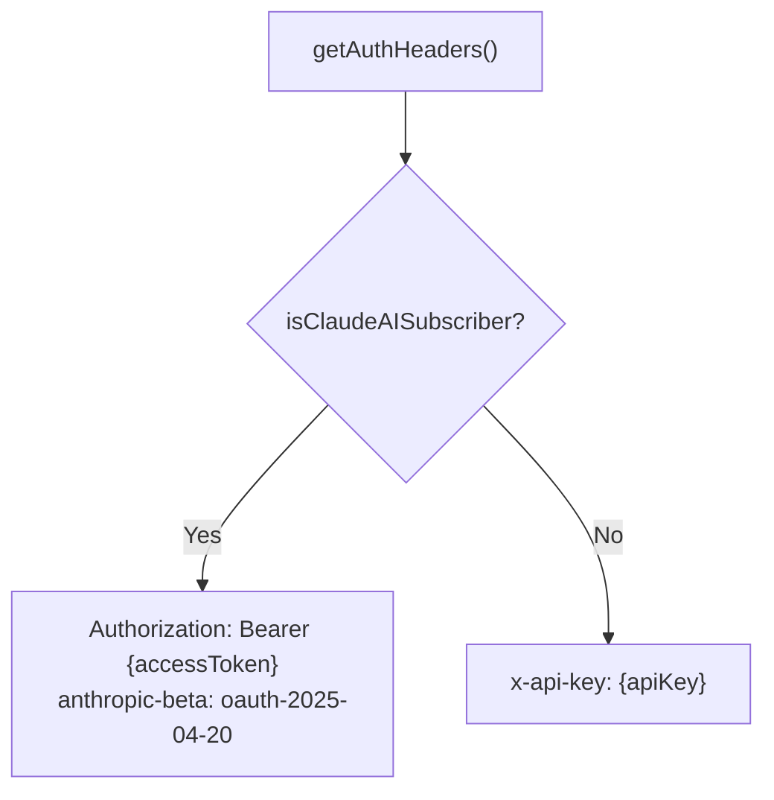
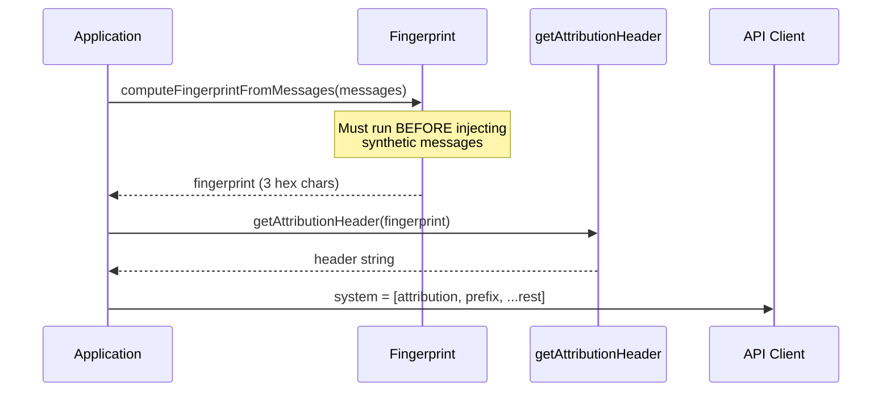
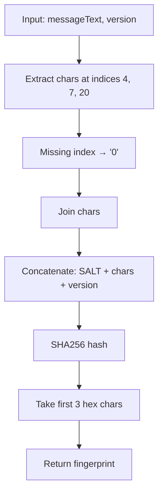
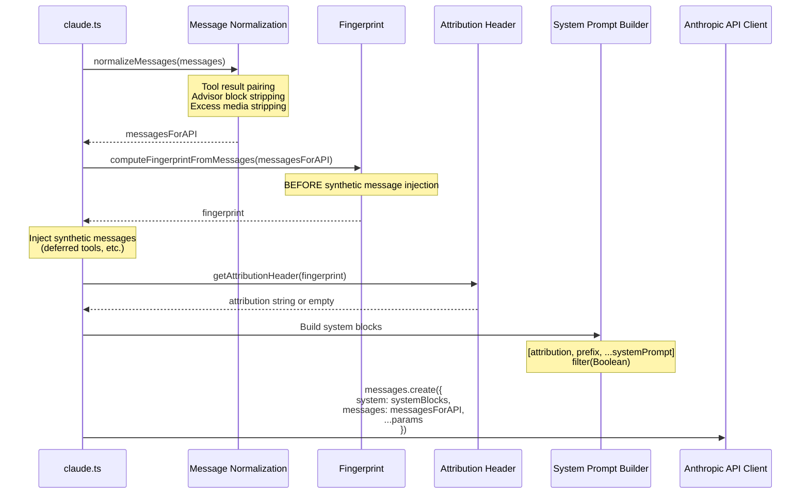
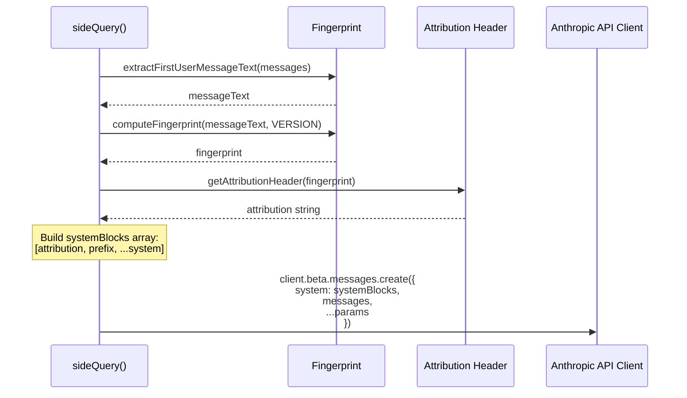
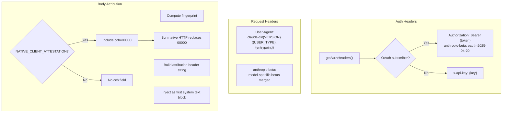
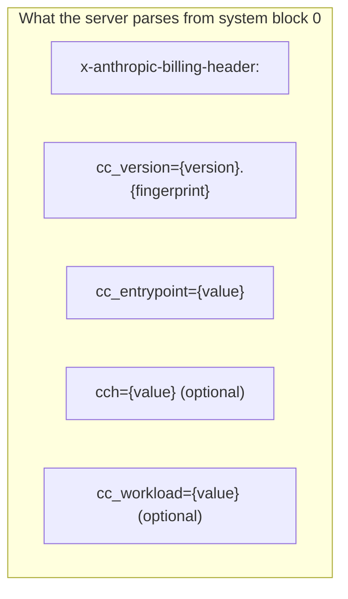
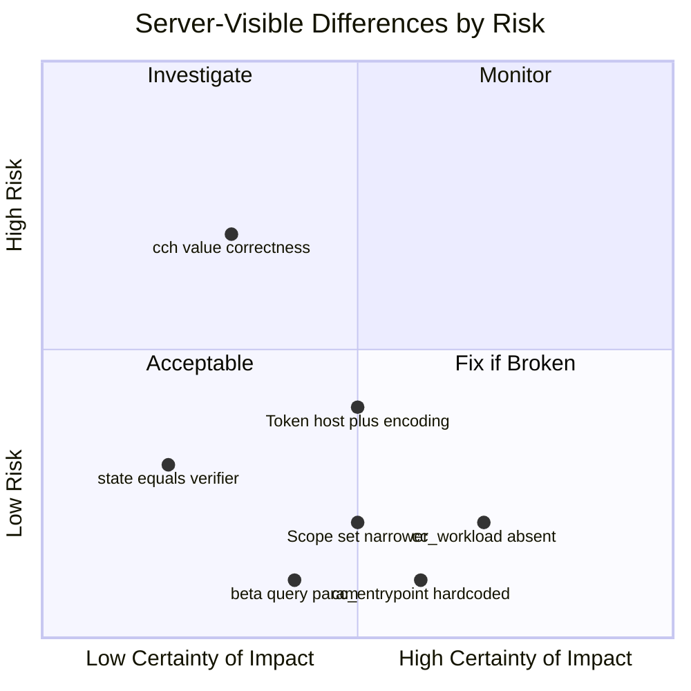

# Claude Code Auth & Header Reference

A factual reference for how Claude Code (Anthropic's official CLI) handles
OAuth authentication, API request headers, attribution headers, fingerprinting,
and `cch` attestation. Every claim in this document cites a specific file and
line range from the Claude Code OSS repository at
`/Users/rmk/projects/oss/claudecode/`.

**This document does not contain assumptions or inferred conclusions.** Where
behavior depends on code outside the OSS repository (e.g. the Bun native HTTP
layer), that is stated explicitly as an unverifiable external dependency.

---

## Table of Contents

- [1. OAuth Flow](#1-oauth-flow)
- [2. API Request Headers](#2-api-request-headers)
- [3. Attribution Header](#3-attribution-header)
- [4. Fingerprint Algorithm](#4-fingerprint-algorithm)
- [5. cch Attestation](#5-cch-attestation)
- [6. Full Request Construction Sequence](#6-full-request-construction-sequence)
- [7. Implementation Gap Assessment](#7-implementation-gap-assessment)

---

## 1. OAuth Flow

### 1.1 PKCE

Claude Code uses standard PKCE with S256 challenge method.

**Source:** `src/services/oauth/crypto.ts:1-23`

```
verifier  = base64url(randomBytes(32))
challenge = base64url(SHA256(verifier))
state     = base64url(randomBytes(32))    // separate from verifier
```

Key fact: **`state` and `verifier` are independent random values.** The state
is generated by `generateState()` (line 21) which calls `randomBytes(32)`
separately from `generateCodeVerifier()` (line 11).

### 1.2 Authorization URL

**Source:** `src/services/oauth/client.ts:46-105`

```
flowchart LR
    A["buildAuthUrl()"] --> B["URL params"]
    B --> C["client_id"]
    B --> D["response_type=code"]
    B --> E["redirect_uri"]
    B --> F["scope"]
    B --> G["code_challenge + S256"]
    B --> H["state (random)"]
    B --> I["code=true"]
```

Parameters:

- `client_id`: `9d1c250a-e61b-44d9-88ed-5944d1962f5e` (prod)
- `response_type`: `code`
- `redirect_uri`: `http://localhost:{port}/callback` (automatic) or `https://platform.claude.com/oauth/code/callback` (manual)
- `scope`: all scopes joined with space
- `code_challenge`: S256 of verifier
- `code_challenge_method`: `S256`
- `state`: independent random value
- `code`: `true` (enables Claude Max upsell page)

### 1.3 OAuth Scopes

**Source:** `src/constants/oauth.ts:33-58`

| Scope Set           | Scopes                                                                                                |
| ------------------- | ----------------------------------------------------------------------------------------------------- |
| Claude.ai           | `user:profile`, `user:inference`, `user:sessions:claude_code`, `user:mcp_servers`, `user:file_upload` |
| Console             | `org:create_api_key`, `user:profile`                                                                  |
| All (default login) | Union of above                                                                                        |

### 1.4 OAuth Endpoints (Production)

**Source:** `src/constants/oauth.ts:84-104`

| Purpose                | URL                                               |
| ---------------------- | ------------------------------------------------- |
| Console authorize      | `https://platform.claude.com/oauth/authorize`     |
| Claude.ai authorize    | `https://claude.com/cai/oauth/authorize`          |
| Token exchange/refresh | `https://platform.claude.com/v1/oauth/token`      |
| Manual redirect        | `https://platform.claude.com/oauth/code/callback` |
| Client ID              | `9d1c250a-e61b-44d9-88ed-5944d1962f5e`            |

### 1.5 Token Exchange

**Source:** `src/services/oauth/client.ts:107-144`

```
POST {TOKEN_URL}
Content-Type: application/json

{
  "grant_type": "authorization_code",
  "code": "{authorization_code}",
  "redirect_uri": "{redirect_uri}",
  "client_id": "{CLIENT_ID}",
  "code_verifier": "{verifier}",
  "state": "{state}",
  "expires_in": {optional}
}
```

Key facts:

- Body is **JSON** (`Content-Type: application/json`, line 131)
- `state` is the random state value, **not** the verifier
- Timeout: 15 seconds (line 133)
- No explicit `User-Agent` header is set on the token exchange (uses axios defaults)

### 1.6 Token Refresh

**Source:** `src/services/oauth/client.ts:146-274`

```
POST {TOKEN_URL}
Content-Type: application/json

{
  "grant_type": "refresh_token",
  "refresh_token": "{refresh_token}",
  "client_id": "{CLIENT_ID}",
  "scope": "{requested_scopes}"
}
```

Key facts:

- Body is **JSON** (`Content-Type: application/json`, line 167)
- Scope expansion is allowed on refresh (line 155-158)
- Default requested scopes: `CLAUDE_AI_OAUTH_SCOPES` (line 161)
- Timeout: 15 seconds (line 168)
- No explicit `User-Agent` header is set on refresh (uses axios defaults)

### 1.7 State Validation

**Source:** `src/services/oauth/auth-code-listener.ts:164-168`

The auth code listener validates `state !== this.expectedState` and rejects
with "Invalid state parameter" if they don't match. This confirms the state
is validated as a CSRF token.

### 1.8 Token Storage

**Source:** `src/utils/auth.ts:1193-1253`, `src/utils/secureStorage/`

Tokens are stored via a `SecureStorage` abstraction:

- macOS: Keychain (`src/utils/secureStorage/macOsKeychainStorage.ts`)
- Other platforms: `~/.claude/.credentials.json` (`src/utils/secureStorage/plainTextStorage.ts`)

Cross-process staleness is detected by stat'ing `.credentials.json` mtime
(`src/utils/auth.ts:1320-1336`).

### 1.9 Token Refresh Locking

**Source:** `src/utils/auth.ts:1447-1530`

Claude Code uses `lockfile.lock(claudeDir)` to serialize concurrent refreshes.
The flow:

1. Check if token is expired
2. Re-read tokens async (another process may have refreshed)
3. Acquire lock on `~/.claude/`
4. Re-read again after lock acquisition
5. Refresh if still expired
6. Release lock

Max retries: 5, with 1-2 second random backoff between retries.

---

## 2. API Request Headers

### 2.1 Authentication Headers

**Source:** `src/utils/http.ts:69-99`



For OAuth-authenticated requests:

- `Authorization: Bearer {accessToken}`
- `anthropic-beta: oauth-2025-04-20`

For API key requests:

- `x-api-key: {apiKey}`

### 2.2 User-Agent

**Source:** `src/utils/http.ts:18-34`

Format:

```
claude-cli/{MACRO.VERSION} ({USER_TYPE}, {entrypoint}{agentSdkVersion}{clientApp}{workload})
```

Example:

```
claude-cli/2.1.90 (external, cli)
```

Where:

- `USER_TYPE` = `process.env.USER_TYPE` (typically `external`)
- `entrypoint` = `process.env.CLAUDE_CODE_ENTRYPOINT ?? 'cli'`
- Optional suffixes for agent SDK version, client app, workload

### 2.3 OAuth Beta Header

**Source:** `src/constants/oauth.ts:36`

```typescript
export const OAUTH_BETA_HEADER = "oauth-2025-04-20" as const;
```

This is the only `anthropic-beta` value added by the auth layer. Additional
beta headers are added per-model by the API client layer, not the auth layer.

---

## 3. Attribution Header

### 3.1 Overview

The attribution header is a system prompt text block that identifies the
client for billing and analytics. It is **not** an HTTP header despite its
name containing "header."

**Source:** `src/constants/system.ts:48-95`

### 3.2 Feature Gate

**Source:** `src/constants/system.ts:52-57`

The attribution header is:

- **Enabled by default**
- Can be disabled via `CLAUDE_CODE_ATTRIBUTION_HEADER` env var (falsy)
- Can be disabled via GrowthBook feature flag `tengu_attribution_header`

### 3.3 Header Format

**Source:** `src/constants/system.ts:73-94`

```
x-anthropic-billing-header: cc_version={version}.{fingerprint}; cc_entrypoint={entrypoint};[ cch=00000;][ cc_workload={workload};]
```

Where:

- `version` = `MACRO.VERSION` (compile-time constant, e.g. `2.1.90`)
- `fingerprint` = 3-hex-char value from fingerprint algorithm (see section 4)
- `entrypoint` = `process.env.CLAUDE_CODE_ENTRYPOINT ?? 'unknown'`
- `cch` = only present when `feature('NATIVE_CLIENT_ATTESTATION')` is true
- `cc_workload` = only present when `getWorkload()` returns a value

### 3.4 Block Placement

**Source:** `src/services/api/claude.ts:1358-1369`, `src/utils/sideQuery.ts:146-167`

The attribution header is:

1. Computed before synthetic message injection
2. Placed in its own standalone system text block
3. Positioned as the **first** system block, before the CLI prefix



The sideQuery path (`src/utils/sideQuery.ts:146-148`) explicitly documents
the standalone block requirement:

> Build system as array to keep attribution header in its own block
> (prevents server-side parsing from including system content in cc_entrypoint)

---

## 4. Fingerprint Algorithm

### 4.1 Salt

**Source:** `src/utils/fingerprint.ts:8`

```
FINGERPRINT_SALT = '59cf53e54c78'
```

The comment says: "Hardcoded salt from backend validation. Must match exactly
for fingerprint validation to pass."

### 4.2 Message Text Extraction

There are two implementations that extract first user message text:

**Main conversation path:** `src/utils/fingerprint.ts:16-38`

Uses internal message types (`UserMessage | AssistantMessage`):

- Finds first message where `msg.type === 'user'`
- Reads `firstUserMessage.message.content`

**Side query path:** `src/utils/sideQuery.ts:69-79`

Uses Anthropic API message types (`MessageParam[]`):

- Finds first message where `m.role === 'user'`
- Reads `firstUserMessage.content`

Both paths then:

- If content is a string, return it directly
- If content is an array, find the first block where `block.type === 'text'` and return `block.text`
- Otherwise return empty string

### 4.3 Fingerprint Computation

**Source:** `src/utils/fingerprint.ts:50-63`



Pseudocode:

```
indices = [4, 7, 20]
chars = indices.map(i => messageText[i] || '0').join('')
input = FINGERPRINT_SALT + chars + version
fingerprint = SHA256(input).hex().slice(0, 3)
```

**Source comment (line 43-44):**

> IMPORTANT: Do not change this method without careful coordination with
> 1P and 3P (Bedrock, Vertex, Azure) APIs.

### 4.4 Timing

**Source:** `src/services/api/claude.ts:1322-1325`

```typescript
// Compute fingerprint from first user message for attribution.
// Must run BEFORE injecting synthetic messages (e.g. deferred tool names)
// so the fingerprint reflects the actual user input.
const fingerprint = computeFingerprintFromMessages(messagesForAPI);
```

The fingerprint is computed from `messagesForAPI` **after** message
normalization (tool result pairing, advisor stripping, excess media
stripping) but **before** synthetic message injection (deferred tool lists).

---

## 5. cch Attestation

### 5.1 What the OSS Code Shows

**Source:** `src/constants/system.ts:60-71, 82`

The TS code:

1. Checks `feature('NATIVE_CLIENT_ATTESTATION')`
2. If true, emits `cch=00000` as a **placeholder**
3. If false, emits no `cch` field at all

The comments explicitly state:

> Before the request is sent, Bun's native HTTP stack finds this placeholder
> in the request body and overwrites the zeros with a computed hash. The
> server verifies this token to confirm the request came from a real Claude
> Code client. See bun-anthropic/src/http/Attestation.zig for implementation.

And:

> We use a placeholder (instead of injecting from Zig) because same-length
> replacement avoids Content-Length changes and buffer reallocation.

### 5.2 What the OSS Code Does Not Show

The actual hash computation is in `bun-anthropic/src/http/Attestation.zig`,
which is **not present** in the Claude Code OSS repository. Therefore:

- The exact algorithm (hash function, seed, masking) **cannot be verified**
  from OSS alone
- The input to the hash (full body bytes, partial body, or other) **cannot be
  verified** from OSS alone
- Whether the hash depends on signing keys, machine state, or build-time
  secrets **cannot be determined** from OSS alone

### 5.3 What Is Known from the OSS Code

From the placeholder mechanics:

- The replacement is same-length (5 chars → 5 chars)
- It operates on the serialized body bytes (implied by "request body" in the
  comment and the Content-Length invariant)
- It is a string search-and-replace, not structured JSON manipulation
- The `cch=00000` pattern appears inside a `"text":"x-anthropic-billing-header:..."` JSON string value in the serialized body

### 5.4 Third-Party Claim (Not OSS-Verified)

A third-party reverse-engineering claim asserts the following algorithm:

```
seed = 0x6E52736AC806831E (bigint)
hash = xxHash64(serializedBodyBytes, seed)
cch  = (hash & 0xFFFFF).toString(16).padStart(5, '0')
```

With regex replacement:

```
/(x-anthropic-billing-header:[^"]*?\bcch=)00000(?=;)/
```

**This algorithm is not verifiable from the OSS codebase.** It may be
accurate, partially accurate, or inaccurate. It is included here for
completeness because our implementation uses it.

---

## 6. Full Request Construction Sequence

### 6.1 Main Conversation Path

**Source:** `src/services/api/claude.ts:1290-1380`



### 6.2 Side Query Path

**Source:** `src/utils/sideQuery.ts:107-198`



### 6.3 Header Construction per Request

**Source:** `src/utils/http.ts:69-99`, `src/services/api/bootstrap.ts`



---

## 7. Wire-Level Gap Assessment

This section evaluates what the **receiving server** sees from a Claude Code
client versus from our `opencode-anthropic-auth` plugin. The comparison is
structured by server endpoint and what each endpoint receives on the wire.
Implementation-internal differences (code architecture, storage format,
locking strategy) are excluded — the server cannot observe them.

### 7.1 Token Endpoint (`/v1/oauth/token`)

The token endpoint receives OAuth exchange and refresh requests.

| Wire Property                | Claude Code Client                                                                        | Our Client                                          | Server Sees Difference?                                                                                                            |
| ---------------------------- | ----------------------------------------------------------------------------------------- | --------------------------------------------------- | ---------------------------------------------------------------------------------------------------------------------------------- |
| **Destination host**         | `platform.claude.com`                                                                     | `console.anthropic.com`                             | **Yes** — different hostname. May route to same backend, or may not.                                                               |
| **Content-Type**             | `application/json`                                                                        | `application/x-www-form-urlencoded`                 | **Yes** — different body encoding. Server must accept both or one will fail.                                                       |
| **Body format**              | JSON object                                                                               | URL-encoded key=value pairs                         | **Yes** — follows from Content-Type.                                                                                               |
| **`state` field (exchange)** | Random value independent of verifier                                                      | Same value as verifier                              | **Yes** — server sees `state === code_verifier`. If the server validates state format or uniqueness separately, this could matter. |
| **`code_verifier`**          | Standard PKCE verifier                                                                    | Standard PKCE verifier                              | No                                                                                                                                 |
| **`client_id`**              | `9d1c250a-e61b-44d9-88ed-5944d1962f5e`                                                    | `9d1c250a-e61b-44d9-88ed-5944d1962f5e`              | No                                                                                                                                 |
| **`scope` (refresh)**        | `user:profile user:inference user:sessions:claude_code user:mcp_servers user:file_upload` | Not sent on refresh                                 | **Yes** — Claude Code requests scope expansion on refresh; we don't send scope.                                                    |
| **User-Agent**               | Axios default (no explicit override)                                                      | `claude-cli/{version} (external, cli)`              | **Yes** — our UA looks more like a Claude CLI client than Claude Code's default axios UA.                                          |
| **`redirect_uri`**           | `https://platform.claude.com/oauth/code/callback` (manual)                                | `https://console.anthropic.com/oauth/code/callback` | **Yes** — different domain. Must match what was registered for the client_id.                                                      |

**Server impact:** The token endpoint currently accepts our requests (form-encoded
on `console.anthropic.com` with `state = verifier`). Changing without testing
could break what works.

### 7.2 Authorization Endpoint (`/oauth/authorize`)

The browser navigates here. The server receives URL parameters.

| Wire Property        | Claude Code Client                         | Our Client                                                  | Server Sees Difference?                                                                                                     |
| -------------------- | ------------------------------------------ | ----------------------------------------------------------- | --------------------------------------------------------------------------------------------------------------------------- |
| **Host**             | `platform.claude.com` or `claude.com/cai/` | `console.anthropic.com` or `claude.ai`                      | **Yes** — different hostnames.                                                                                              |
| **`scope`**          | 6 scopes (union of console + claude.ai)    | 3 scopes (`org:create_api_key user:profile user:inference`) | **Yes** — server grants different scope sets. Missing: `user:sessions:claude_code`, `user:mcp_servers`, `user:file_upload`. |
| **`state`**          | Random 43-char base64url                   | Verifier (43-char base64url)                                | Likely no — both are opaque 43-char strings. Server probably treats state as an opaque round-trip value.                    |
| **`code=true`**      | Present                                    | Present                                                     | No                                                                                                                          |
| **`code_challenge`** | S256 hash of verifier                      | S256 hash of verifier                                       | No                                                                                                                          |

### 7.3 API Endpoint (`POST /v1/messages`)

This is the primary inference endpoint. The server receives HTTP headers and
a JSON body.

#### 7.3.1 HTTP Headers

| Header                                        | Claude Code Client                                     | Our Client                                                    | Server Sees Difference?                                                                                           |
| --------------------------------------------- | ------------------------------------------------------ | ------------------------------------------------------------- | ----------------------------------------------------------------------------------------------------------------- |
| **Authorization**                             | `Bearer {accessToken}`                                 | `Bearer {accessToken}`                                        | No                                                                                                                |
| **anthropic-beta**                            | `oauth-2025-04-20` + model-specific betas added by SDK | `oauth-2025-04-20` + profile-based betas merged with incoming | Depends on request — our beta list is a superset from the profile. The key `oauth-2025-04-20` is present in both. |
| **User-Agent**                                | `claude-cli/{VERSION} ({USER_TYPE}, {entrypoint})`     | `claude-cli/{version} (external, cli)`                        | Minor — ours always says `external, cli`; Claude Code may say `ant, cli` or include agent-sdk/workload suffixes.  |
| **anthropic-version**                         | Not set explicitly by auth layer (SDK default)         | `2023-06-01` (from profile)                                   | Likely no — both resolve to the same value on the wire.                                                           |
| **anthropic-dangerous-direct-browser-access** | Not set by auth layer                                  | `true` (from profile)                                         | **Yes** — we send this explicitly; Claude Code relies on SDK internals.                                           |
| **x-api-key**                                 | Not present (OAuth path)                               | Explicitly deleted                                            | No — neither sends it.                                                                                            |
| **x-stainless-\***                            | Set by Anthropic SDK dynamically                       | Set from static profile values                                | Possibly — values like `x-stainless-runtime-version` may differ from a live SDK.                                  |
| **x-app**                                     | Not set by auth layer                                  | `cli` (from profile)                                          | Possibly — depends on SDK internals.                                                                              |

#### 7.3.2 Request Body — Attribution Header (system[0].text)

When attribution is enabled, both clients send a `system[0]` text block
containing the billing header string. The server parses fields from this
string.



| Field                        | Claude Code on Wire                                       | Our Client on Wire                                   | Server Sees Difference?                                                                                                                                          |
| ---------------------------- | --------------------------------------------------------- | ---------------------------------------------------- | ---------------------------------------------------------------------------------------------------------------------------------------------------------------- |
| **`cc_version` base**        | e.g. `2.1.90`                                             | e.g. `2.1.90`                                        | No — identical when profile version matches.                                                                                                                     |
| **`cc_version` fingerprint** | 3 hex chars from `SHA256(salt + chars[4,7,20] + version)` | Same algorithm, same salt, same indices              | No — server sees identical fingerprint for identical message + version.                                                                                          |
| **`cc_entrypoint`**          | Variable (`cli`, `unknown`, `claude-desktop`, etc.)       | Always `cli`                                         | Minor — server sees consistent `cli` from us vs variable from Claude Code. If used for analytics/routing only, no functional impact.                             |
| **`cch` presence**           | Only when `NATIVE_CLIENT_ATTESTATION` feature flag is on  | Always when `billing_header` config is on            | **Possibly** — if the flag is off in some Claude Code builds, those send no `cch`. We always include it when billing headers are enabled.                        |
| **`cch` value**              | Computed by `Attestation.zig` (not in OSS)                | Computed by `xxHash64` with third-party-claimed seed | **Unknown** — cannot verify whether our values match. If the server validates `cch`, ours may or may not pass. If the server only logs it, no functional impact. |
| **`cc_workload`**            | Present when `getWorkload()` returns a value              | Never present                                        | **Yes** — server never sees `cc_workload` from us. OSS comment says server "tolerates unknown extra fields" and absent = interactive default.                    |
| **Trailing format**          | `cc_version={v}; cc_entrypoint={e}; cch={c};`             | `cc_version={v}; cc_entrypoint=cli; cch={c};`        | No — same semicolon-separated format.                                                                                                                            |

#### 7.3.3 Request Body — Other Fields

| Property                   | Claude Code on Wire                                           | Our Client on Wire                         | Server Sees Difference?                                                                                             |
| -------------------------- | ------------------------------------------------------------- | ------------------------------------------ | ------------------------------------------------------------------------------------------------------------------- |
| **system[1]**              | `"You are Claude Code, Anthropic's official CLI for Claude."` | Same text (rewritten from "OpenCode")      | No — server sees identical text.                                                                                    |
| **Tool names**             | No `mcp_` prefix                                              | `mcp_` prefix added (e.g. `mcp_read_file`) | **Yes** — the `oauth-2025-04-20` beta likely expects this prefix for OAuth clients.                                 |
| **`?beta=true` URL param** | Not appended                                                  | Appended to `/v1/messages`                 | **Yes** — we add this query param; Claude Code does not appear to. If the server ignores unknown params, no impact. |

### 7.4 Risk Summary from Server Perspective



| Risk Level             | Wire Difference                     | Rationale                                                                                                           |
| ---------------------- | ----------------------------------- | ------------------------------------------------------------------------------------------------------------------- |
| **Unknown risk**       | `cch` value correctness             | Cannot verify our values match what the server expects. Currently working, but server-side validation could change. |
| **Low risk, working**  | Token endpoint host + body encoding | Currently functional. Server accepts our requests today.                                                            |
| **Low risk**           | `state = verifier`                  | Both are opaque 43-char base64url strings. Server likely treats state as round-trip value.                          |
| **No functional risk** | `cc_workload` absent                | Absent = interactive default per OSS comments. Server tolerates missing fields.                                     |
| **No functional risk** | `cc_entrypoint` always `cli`        | Analytics/routing difference only. No evidence of rejection.                                                        |
| **No functional risk** | Narrower scope set                  | We request fewer scopes. Only matters if we need those features later.                                              |
| **No functional risk** | `?beta=true` query param            | No evidence of rejection. May be vestigial.                                                                         |

---

_Document generated from Claude Code OSS at `/Users/rmk/projects/oss/claudecode/`._
_Last updated: 2026-04-02._
