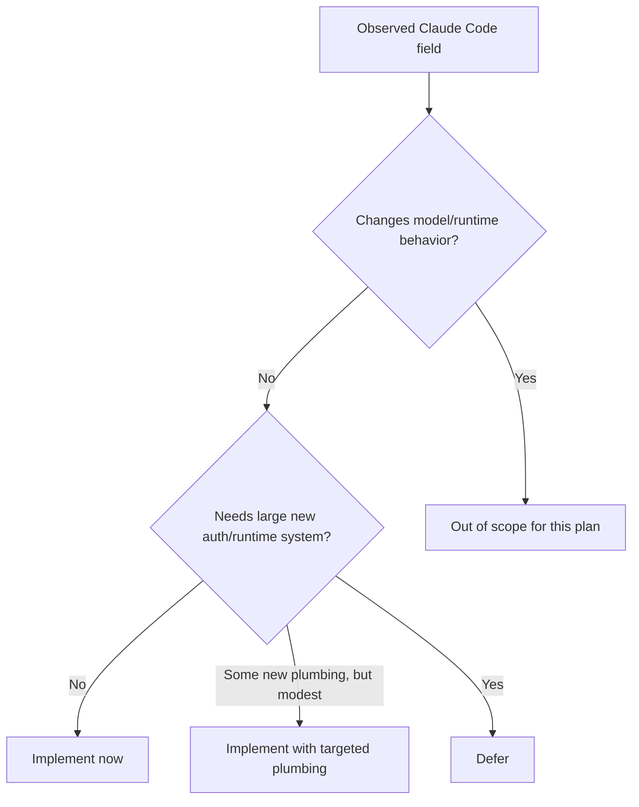
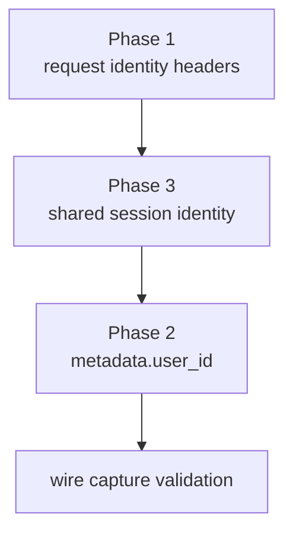

# Server-Visible Claude Code Alignment Plan

This plan focuses only on **what the server sees** from our client compared to
Claude Code. It explicitly avoids internal code-structure parity and avoids any
change that would materially alter our client behavior.

The goal is:

1. make our wire output look as much like Claude Code as possible
2. only implement items that are **not a massive undertaking** and **do not
   change client behavior**

If implementation reveals a scope cut, simplification, or fallback that would
leave a server-visible Claude Code field out of parity for reasons other than
model-behavior risk or truly massive implementation cost, that is a
**compromise** and requires explicit user approval before proceeding.

This document is grounded in:

- Claude Code OSS source at `/Users/rmk/projects/oss/claudecode/`
- actual captured Claude Code Opus requests from `rig-context-inspector`
- our current plugin code at `/Users/rmk/projects/tools/opencode-anthropic-auth`

---

## Scope Rule

### In scope

Server-visible fields that are:

- request-tracing / analytics / attribution metadata
- deterministic headers or body metadata
- safe to synthesize without changing model selection, tool behavior, or output behavior

### Out of scope for this plan

Anything that changes model behavior or request semantics, including:

- `thinking`
- `tool_choice`
- `output_config`
- `temperature` behavior tied to thinking
- `getExtraBodyParams()` parity
- dynamic feature-gated betas that enable or disable model/runtime features

These are not “wire cosmetics”; they are behavior controls.

---

## Verified Claude Code Server-Visible Fields

### Already matched by our current implementation

- `User-Agent: claude-cli/2.1.92 (external, cli)`
- `Authorization: Bearer ...`
- `anthropic-version: 2023-06-01`
- `anthropic-dangerous-direct-browser-access: true`
- `x-app: cli`
- billing header in `system[0].text`
- `cc_version=2.1.92.<fingerprint>`
- fingerprint algorithm
- `cch` placeholder/signing for the currently captured requests

### Observed in Claude Code traffic but not currently synthesized by us

#### Headers

- `x-claude-code-session-id`
- `x-client-request-id`

#### Body fields

- `metadata`
  - specifically `metadata.user_id`, where the value is a JSON string
  - shape from Claude Code OSS (`src/services/api/claude.ts:503-527`):
    - `device_id`
    - `account_uuid`
    - `session_id`
    - optional extra metadata from env

#### Not safe for this plan

- `thinking`
- `tool_choice`
- `output_config`

---

## Feasibility Assessment



### Safe and not massive

1. `x-client-request-id`
2. `x-claude-code-session-id`
3. `metadata.user_id.session_id`
4. `metadata.user_id.device_id`
5. `metadata.user_id.account_uuid`

### Safe but requires modest new plumbing

1. stable `device_id` persistence
2. stable process/session ID generation
3. OAuth account UUID capture/storage and propagation into request metadata

### Not safe / excluded

1. `thinking`
2. `tool_choice`
3. `output_config`
4. behavior-affecting betas tied to those body params

---

## Phase Plan

## Phase 1: Add Request Identity Headers

### Goal

Make the server see the two request identity headers that Claude Code sends on
first-party Anthropic requests.

### Target headers

#### `x-client-request-id`

Claude Code source:

- `src/services/api/client.ts:356-376`
- `src/services/api/claude.ts:1810-1829`

Behavior:

- generated with `randomUUID()`
- first-party only
- set per request
- caller can pre-set it, otherwise Claude Code generates it

#### `x-claude-code-session-id`

Claude Code source:

- `src/services/api/client.ts:101-116`

Behavior:

- set in `defaultHeaders`
- value is `getSessionId()`
- stable for the lifetime of the Claude Code session

### Our implementation target

- Add both headers only for `api.anthropic.com` requests
- Generate `x-client-request-id` as a per-request UUID
- Generate `x-claude-code-session-id` as a stable process/session UUID
- Do not overwrite caller-provided values if they already exist

### Why this is safe

- headers are tracing/session identity only
- they do not alter model behavior
- they are already present in observed Claude Code traffic

### Files likely touched

- `lib/request-transform.mjs`
- `index.mjs`
- `index.test.mjs`

### Validation

- request header tests for presence and preservation of caller-provided values
- rig-context-inspector capture confirming headers appear on the wire

---

## Phase 2: Add `metadata.user_id`

### Goal

Make the request body include Claude Code-style `metadata.user_id` for
Anthropic requests.

### Claude Code source

- `src/services/api/claude.ts:503-527`
- `src/utils/config.ts:1757-1765`

Claude Code sends:

```json
{
  "metadata": {
    "user_id": "{\"device_id\":\"...\",\"account_uuid\":\"...\",\"session_id\":\"...\"}"
  }
}
```

Important detail:

- `user_id` is a **JSON-encoded string**, not a nested object

### Field-by-field plan

#### `device_id`

Claude Code behavior:

- persistent random 32-byte hex string
- stored in global config via `getOrCreateUserID()`

Our safe replication target:

- generate once and persist in our config
- use the same 64-hex-char shape

This is safe because it affects analytics/identity only, not model behavior.

#### `session_id`

Claude Code behavior:

- stable session ID for the running Claude session

Our safe replication target:

- one UUID generated per process/plugin runtime
- reused for `x-claude-code-session-id` and `metadata.user_id.session_id`

#### `account_uuid`

Claude Code behavior:

- populated from OAuth account info when available
- empty string otherwise

Our target:

- capture and persist the real OAuth `account_uuid`
- propagate it into `metadata.user_id`
- only use empty string when the upstream auth state truly lacks an account UUID

Why this is now in scope:

- it is server-visible identity metadata
- it does not alter model behavior
- the user explicitly said auth-flow/plumbing changes are acceptable when the
  goal is to better match what the server sees

Constraint:

- never synthesize or guess a fake UUID
- if the real value is not recoverable from the OAuth flow/state, stop and ask
  before compromising to an always-empty fallback

### Merge behavior

- If upstream request body already contains `metadata`, merge into it
- Preserve existing metadata fields
- Set or update only `metadata.user_id`

### Why this is safe

- top-level metadata is not prompt-visible content
- it is not a model-control field like `thinking` or `tool_choice`
- it is present in Claude Code traffic specifically for server-side identity/logging

### Files likely touched

- `lib/request-transform.mjs`
- `lib/config.mjs`
- `lib/config.test.mjs`
- `index.test.mjs`

### Validation

- unit tests for merged metadata shape
- ensure `user_id` is a JSON string, not object
- ensure `device_id` is stable across loads
- ensure `session_id` is stable within a process
- ensure `account_uuid` is populated from authoritative auth state when available
- ensure empty string is used only when the authoritative auth state truly lacks an account UUID

---

## Phase 3: Session Identity Plumbing

### Goal

Unify session identity so the same value is used consistently across:

- `x-claude-code-session-id`
- `metadata.user_id.session_id`

### Requirements

- single source of truth
- initialized once per runtime
- easy to inject into request-building path

### Why this is needed

If we generate these separately, the server sees two unrelated session IDs,
which is not what Claude Code does.

### Files likely touched

- new helper module, e.g. `lib/session-identity.mjs`
- request path callers/tests

### Validation

- tests proving both header and metadata use the same session ID

---

## Explicitly Excluded Work

These fields should **not** be part of this plan because they can change
behavior, not just server-observed identity.

### `thinking`

Claude Code source:

- `src/services/api/claude.ts:1596-1629`

Why excluded:

- directly controls adaptive vs budgeted thinking
- changes model output behavior

### `tool_choice`

Claude Code source:

- `src/services/api/claude.ts:1711-1713`

Why excluded:

- changes tool invocation behavior and model API contract

### `output_config`

Claude Code source:

- `src/services/api/claude.ts:1559-1588`

Why excluded:

- controls effort/task budget/structured output behavior
- directly changes model/runtime behavior

### `temperature` parity

Claude Code source:

- `src/services/api/claude.ts:1691-1695`

Why excluded:

- tied to whether thinking is enabled
- changes output behavior

---

## Acceptance Criteria

This plan is complete when:

1. every Anthropic request we send includes:
   - `x-client-request-id`
   - `x-claude-code-session-id`
2. every Anthropic JSON body includes merged `metadata.user_id`
3. the server sees the same `session_id` value in both header and metadata
4. `device_id` is stable across runs
5. `account_uuid` is authoritative when available and never guessed
6. empty-string fallback is used only when the authoritative auth state genuinely lacks an account UUID
7. no model behavior changes occur
8. all tests pass
9. live capture confirms the new wire fields are present exactly where expected

---

## Open Questions

These should be answered before implementation starts, but none block the safe fields.

1. Where should `device_id` live in our config/state?
   - likely global config, not account storage

2. What is the right lifecycle for our session ID?
   - process lifetime is probably the closest analogue to Claude Code session lifetime

3. Where is the cleanest authoritative source for OAuth `account_uuid` in our plugin?
   - this is now an implementation question, not a scope question

---

## Recommended Execution Order



Practical order:

1. implement shared session identity helper
2. add `x-claude-code-session-id`
3. add `x-client-request-id`
4. add `metadata.user_id`
5. validate in live captures

---

## Final Recommendation

Proceed with:

- `x-claude-code-session-id`
- `x-client-request-id`
- `metadata.user_id` (`device_id`, `session_id`, real `account_uuid` when available)

If implementation reveals a new compromise is needed for any of the above,
pause and ask the user before cutting scope.

Do **not** proceed in the same pass with:

- `thinking`
- `tool_choice`
- `output_config`
- temperature/thinking parity

Those are behavior controls, not safe wire-shape replication.
